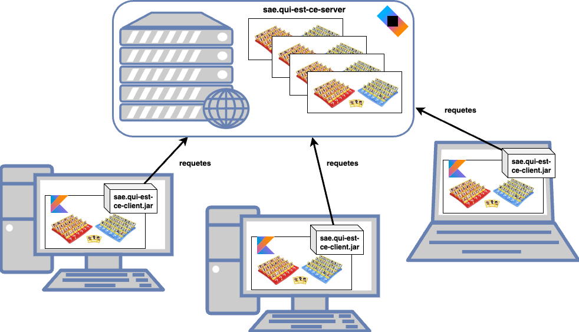
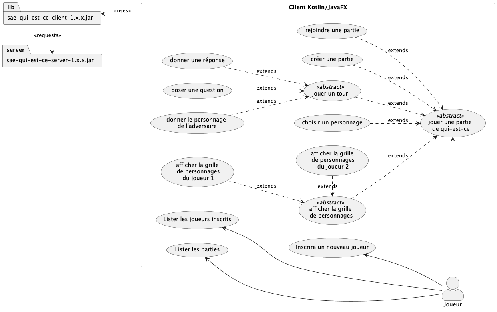
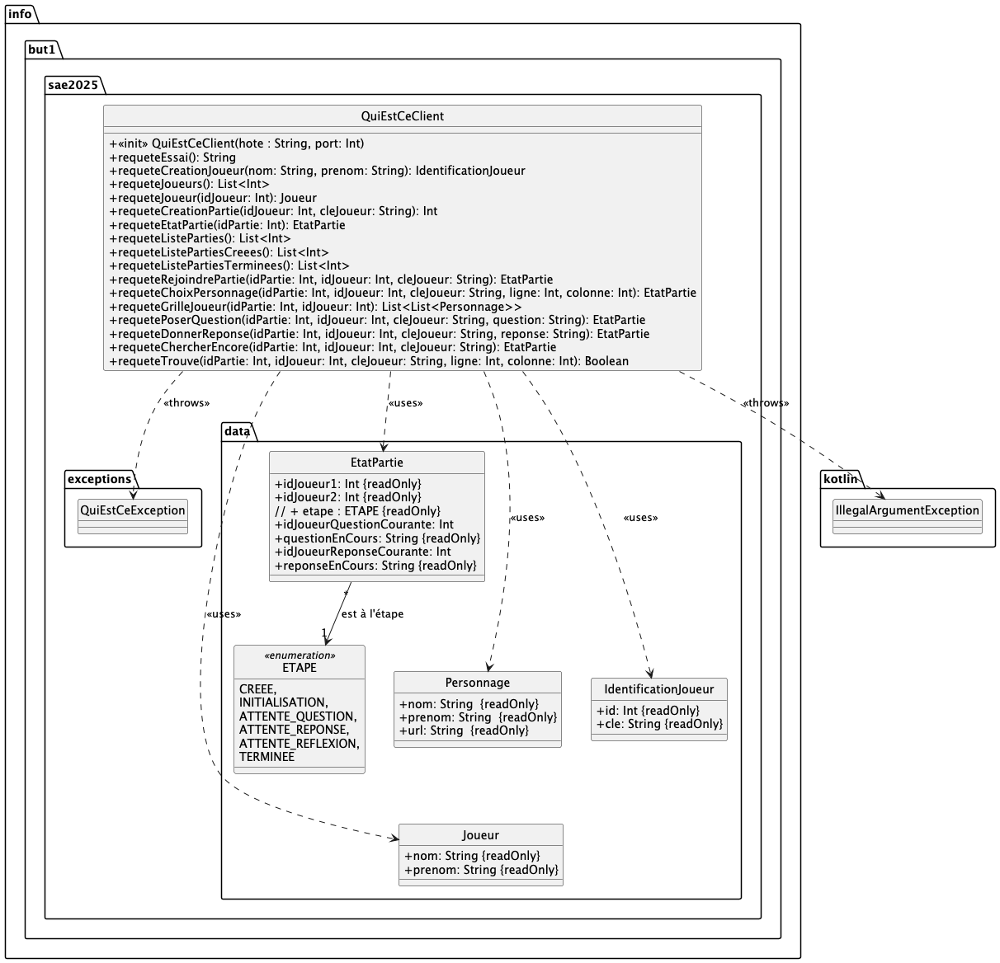
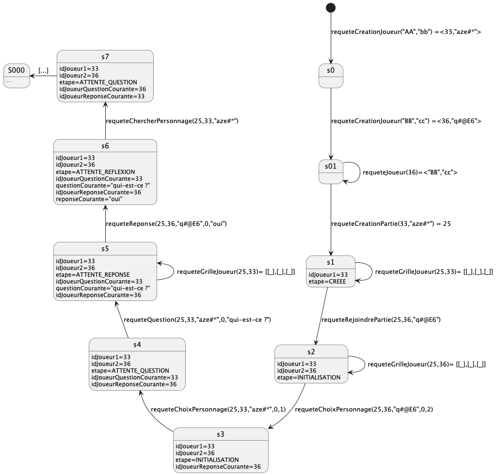

# SAE 2.01 : développement d'une application > Qui-est-ce à l'IUT

Les 3 prochaines semaines sont consacrées à plusieurs SAEs, en particulier la SAE "2.01 : développement d'une application". Cette SAE est commune aux ressources **"dev.objets"**, **"IHM"** et **"Qualité/tests"**. L'objectif principal est de vous permettre de mettre en pratique et de consolider les compétences normalement acquises dans ces 3 ressources (mais pas que).

Cette année, on va vous demander de développer une application permettant de jouer au [Qui-est-ce ?](https://fr.wikipedia.org/wiki/Qui_est-ce_%3F), adapté avec vos photos de promotion.

plus précisément, vous devrez développer un client en **Kotlin/JavaFX** qui devra interagir avec un serveur de jeu, en utilisant une librairie spécifique vous permettant d'interagir facilement avec le serveur ; le diagramme de cas d'utilisation suivant résume les attendus de votre application cliente. 

**NB : la librairie et le serveur ont été développés par nos soins ; vous n'aurez qu'à les utiliser.**

## Organisation du projet

Vous aurez 3 périodes de 3-4 jours sur les semaines **23, 24 et 25** pour réaliser l'ensemble du travail demandé, en équipe de **~4 développeur.se.s**  (on pourrait appeler ces périodes des "sprints", mais nous ne verrons cela que l'an prochain dans la ressource R3.10 avec l'agilité.)

Vous devrez **OBLIGATOIREMENT** travailler à l'IUT, sur tous les créneaux "Développement d'application" apparaissant dans votre emploi du temps; des enseignants seront présents sur certains créneaux pour vous guider/répondre à d'éventuelles questions / vous assister, mais également pour évaluer votre manière de travailler en équipe. (voir [Edt info1](https://edt.univ-nantes.fr/iut_nantes/g3145.html))

Les enseignants impliqués sont *Christine Jacquin, Emmanuel Bigeon, Jean-Marie Mottu et Arnaud Lanoix Brauer*.

## Questions / échange avec l'équipe enseignante

En plus des temps de présence des enseignants durant certaines séances, pour échanger avec nous, vous utiliserez le mattermost dédié ; rejoignez-nous au plus vite sur le [mattermost iut.info1.sae2011](https://mattermost.univ-nantes.fr/signup_user_complete/?id=7crgg3nop789tqngq38rm8irwr&md=link&sbr=su) (utilisez gitlab pour vous connecter à mattermost). 

**NB : nous n'utiliserons aussi que cet outil pour communiquer vers vous des informations descendantes, par exemple, des précisions dans le sujet ou une MAJ de la librairie.**

## Droit à l'image

Si vous ne souhaitez pas que votre photo de trombinoscope soit utilisée dans le cadre de ce projet, indiquez le rapidement par [ici](https://framadate.org/W4LY7PSCYqOJPd1n) (deadline **jeudi 05 juin** soirée).

**NB : Si vous ne l'indiquez pas avant cette deadline, votre photo sera par défaut utilisée.**

## Groupe-projet

Vous constituerez des équipes de 4 étudiant-e-s au sein de votre groupe TD (possiblement 3 ou 5 uniquement si le nombre d'étudiant-e-s du groupe l'impose).
Vous remplirez le document partagé [suivant](https://docs.google.com/spreadsheets/d/1WnKFH2F8EH4KOKrea1cGKtnbhQ31ao6xA0KGZhoxzrE/edit?usp=sharing).

## Utilisation d'un dépôt git

Vous devrez tous utiliser convenablement un dépôt git.
Vous utiliserez **OBLIGATOIREMENT** le serveur gitlab de l'université.

l'un des membres de l'équipe-projet demandera l'accès au sous-groupe [sae201.2025/projets-etudiants/](https://gitlab.univ-nantes.fr/iut.info1.dev.objets/2024-2025/sae201.2025/projets-etudiants) en cliquant sur les trois **petits points** en haut à droite, puis "*Demande d'accès*" (**attention**, il faut être identifié sur gitlab ;-)

une fois son accès au sous-groupe validé,
Il/elle créera dans le sous-groupe, un dépôt en veillant à ce que votre projet git respecte la convention de nommage suivant : `2025.SAE201.<N°TD><n°Equipe>` (colonne Depot-git du fihcier excel partagé). Il/elle ajoutera ensuite tous les autres membres du projet au dépôt git créé.

Vous utiliserez ensuite votre dépôt pour travailler à plusieurs et partager
votre code ; vos rendus se feront également via votre dépôt git.

> Un "bon" usage de git implique forcément des commits/pushs réguliers plusieurs fois
> par 1/2 journée de travail ; en plus c'est facile pour nous d'observer cela ;-).

## La librairie `sae-qui-est-ce-client-1.x.x.jar`

Une librairie vous est fournie pour interagir avec le serveur de jeu. 

Le fonctionnement général est décrit par le diagramme d'états-transitions (incomplet) suivant :

> Le serveur ne vous dira pas quand il aura changé d'état ; c'est à vous de l'interroger régulièrement, via la méthode `requeteEtatPartie(...)`, pour savoir si c'est à vous de jouer ou pas encore 

La librairie dans sa version actuelle est disponible ici : [telechargements/sae-qui-est-ce-client-1.0.jar](telechargements/sae-qui-est-ce-client-1.0.jar).

La documentation de la librairie est disponible sous la forme de page HTML générée avec Dokka : [telechargements/documentation.zip](telechargements/documentation.zip) 

Un projet vierge vous est également fourni  (incluant la librairie) afin de faciliter l'initialisation de votre travail : [telechargements/sae-projet-vierge.zip](telechargements/sae-projet-vierge.zip)

##### Le serveur de jeu (MAJ du 10/06-18:32)

La configuration du serveur vous est précisé ici 

	 ADDRESS : 172.26.69.145
	 PORT : 8080
	 
Le serveur ne sera accessible que depuis le réseeau de l'IUT ; pour y accéder depuis chez vous ou depuis vos ordinateurs personnels, il vous faudra utiliser [EduVPN](https://wiki.univ-nantes.fr/doku.php?id=personnels:eduvpn:client_lourd). 	 

##### serveur du jeu local

Télécharger le serveur [server-all.jar](telechargements/server-all.jar) ainsi que les ressources nécessaires [resources.zip](telechargements/resources.zip) ;

Décompressez le dossier de ressources ;

Lancez le serveur : 

		java -jar  server-all.jar "localhost" 8080 resources/

##### Les photos pour la grille

Les photos seront accessibles via l'URL suivante : `http://ADDRESS:PORT/resources/but1/NOM-prenom.jpg`
où  `NOM-prenom.jpg` correspondra au champ `url` des objets `Personnage` renvoyés par la librairie 

## Travail à faire

Plusieurs tâches vous sont demandées dans cette SAE.

### Analyse du jeu Qui-est-ce?

1. Il vous est demandé de concevoir un diagramme de classes UML *niveau Analyse* décrivant le jeu Qui-est-ce  ; vous apporterez une attention particulière aux respects des notations et des concepts UML.

> cette étape est complètement **indépendante** de tous les choix techniques, il s'agit de décire le jeu qui-est-ce sans considérer le langage Kotlin/JavaFX, le serveur, la librairie, etc.

2. Il vous est ensuite demandé un second diagramme de classes UML *niveau Conception Architecturale* qui sera un "raffinement" du diagramme précédent précisant vos choix "techniques" d'implémentation ainsi que votre compréhension de la librairie `sae-qui-est-ce-client-1.x.x.jar`

> cette étape doit considérer qu'un certain nombre de choix d'implémentation ont été fait pour vous : un jeu client-serveur, le serveur implémenté par qq'un d'autre, une librairie à utiliser, le choix du langage Kotlin et du tooklit graphique JavaFX, etc.

### Maquettage de votre client

Vous produirez une maquette des vues de votre future application.  Vous apporterez une attention particulière aux interactions de l'utilisateur avec votre application (fenêtre de dialogue de confirmation d'action, d'avertissement de l'utilisateur avant une action, possibilité d'annuler une action, ... )

### Test de la librairie `sae-qui-est-ce-client-1.x.x.jar`

Une librairie vous est fournie pour interagir avec le serveur de jeu. Il vous est demandé de concevoir et d'implémenter des cas de tests Junit afin de tester **méthodiquement** cette librairie.
Il s'agit de mettre en oeuvre les techniques étudiées en R2.03, en particulier

- conception de tests unitaires par approche fonctionnelle
- analyse de la testabilité 
- implémentation de test unitaires
- diagnostic

Toutes les fonctions doivent être testées.  

> *Indication :* il y a 15 méthodes + un constructeur dans la librairie ; vous devriez concevoir et implémenter en moyenne 5 cas de tests par constructeur/méthodes, 5*16 = 80 cas de tests à minima. 

> Il est bien possible que vous trouviez des bugs. N'hésitez pas à nous les remonter via le mattermost ; **ce sera bonifié !!!!** Remontez un bug consiste à partager un cas de test qui échoue, suffisamment documenté pour comprendre pourquoi. C'est encore mieux, si une version corrigée du code est partagée également.

### Développement 

Comme déjà indiqué, il vous est demandé de développer une application cliente utilisant un serveur de jeu fourni. Votre application devra être développée en **Kotlin/javaFX**, et respecter le patron architectural MVC.

Plus précisément, vous devrez développer les vues en JavaFX correspondantes aux maquettes proposées.

Vous implémenterez un ensembe de classes correspondant aux diagrammes de classes proposés

Votre application interagira **obligatoirement** avec le serveur de jeu en utilisant la librairie fournie.

Tout développement doit être accompagné de cas de tests, vous développerez donc des cas de test Junit, au moins pour la partie modèle de votre application.

## Rendus et Deadline

Vous serez évaluer sur différents aspects du projet : ananlyse & spécifications, développement proprement dit, tests et présentation du projet.

Les modèles UML ainsi que les maquettes de votre future application seront pushés sur votre dépot git pour le **mardi 10/06 à 12h30**
- `documentation/modelesUML.pdf` - contenant les 2 diagrammes UML ainsi que d'éventuelles explications/précisions
- `documentation/maquette.pdf`  - les différentes maquettes ainsi que d'éventuelles explications/précisions

Votre travail de projet en équipe sera évalué tout au long du projet par les enseignants encadrant certaines séances.

Une version finale de votre application sera attendue pur le **mercredi 18/06 après-midi** : une revue technique de votre projet sera réalisée avec certain(e)s enseignant(e)s afin d'évaluer votre développement proprement dit : démonstration, revue de code, etc.

Le vendredi **20/06** une revue de tests sera réalisée afin d'évaluer la pertinence et la qualité des cas de tests que vous aurez proposés pour tester la librairie, mais aussi votre code proprement-dit. N'attendez pas le jeudi 19/06 pour tester : le code aura été évalué la veille. Néanmoins, les corrections de vos propres développements grace aux tests seront appréciées le vendredi 20/06.
  

